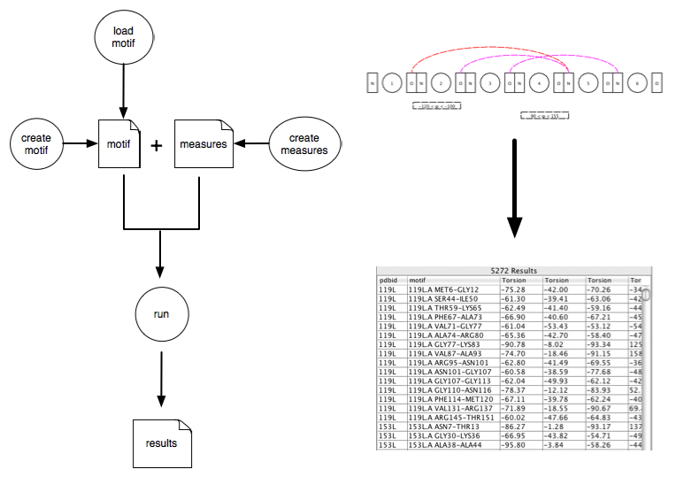

Overview 
------

This is a protein motif search library written in Java. It allows clients to describe a pattern constrained by various properties and geometric measures. The results can have measurements defined on them.

- [Quickstart](quickstart.md)
- [Patterns](pattern_definition.md)
- [Conditions](conditions.md)
- [Measures](measures.md)
- [Examples](functional_examples.md)
- [Resources](resources.md)

